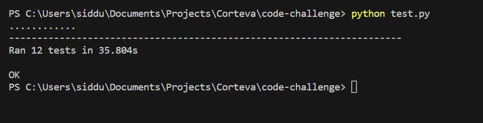
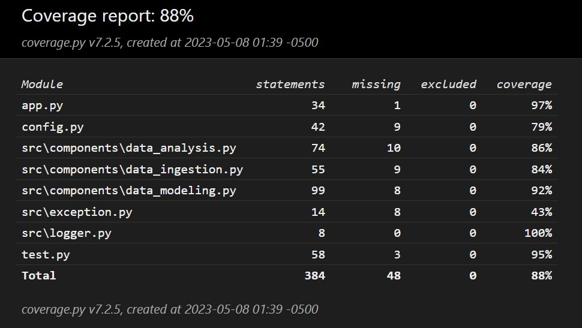

[](https://vscode.dev/github/siddusaikumar-git/CodingChallenge)

# Coding Challenge

This Repository is to generate backend API's of weather data and its statistics from Weather Data containing minimum temperature, maximum temperature and precipitation corresponds to a particular weather station from Nebraska, Iowa, Illinois, Indiana, or Ohio from 1985-01-01 to 2014-12-31 with data stretching over 1.7 Million records, Hence the task is to query the Weather data and statistics corresponding to weather station and year.

Below are design considerations are taken to best possibly align the [code challenge document](https://github.com/siddusaikumar-git/CodingChallenge/blob/master/code_challenge_doc.txt)

# Pre-requisites

1. [Python v3.11](https://www.python.org/downloads/)
2. [PostgresSQL v15](https://www.postgresql.org/download/)

## Install Dependencies

```bash
    pip install -r requirements.txt
```

## Database creation in postgreSQL

create a datbase name "weather" and open the query tool to create the tables as below

## Create Tables

create tables "weatherdata" and "weatherstats" with the below queries.

```sql
/* weatherdata table */

DROP TABLE weatherdata;

CREATE TABLE weatherdata (
    stationid VARCHAR(20) NOT NULL,
    date DATE NOT NULL,
    year INTEGER NOT NULL,
    maxtemp INTEGER,
    mintemp INTEGER,
    precipitation INTEGER
    );

/* weatherstats table */

DROP TABLE weatherstats;

CREATE TABLE weatherstats (
    stationid VARCHAR(20) NOT NULL,
    year INTEGER NOT NULL,
    avgmaxtemp REAL,
    avgmintemp REAL,
    totalprecipitation REAL
    );
```

## Environment variables

Create a ".env" file, in the root folder and add the below configurations

```env

HOST=<host name>            // default is "localhost"
DATABASE=<database name>    // default is "weather"
USER=<user name>            // default is "postgres"
PASSWORD=<password>


PAGE_COUNT=<page count>     // default is "10"

DEV_HOST=<url host>         // default is 127.0.0.1
DEV_PORT=<url port>         // default is 5000

```

# Execution

## Data Ingestion

Now once all the [pre-requisites](#Pre-requisites) installed, open in your favorite code editor and in the root folder, run the following command.

```bash
    python main.py
```

This command executes code to perform data ingestion to postgres database into respective tables created above.

## Accessing APIs

Now once data ingestion is done, we are good to access api's, do start flask service run the below command.

```bash
    python app.py
```

Now in the code you will see the app is running in development mode and able to listen to default localhost and port of Flask API [localhost link](http://localhost:5000/), you will see the link to access swagger API.
else goto link [Swagger API](http://localhost:5000/swagger)

## Unit Tests

To run unit tests, execute the following command

```bash
    python test.py
```

below is the result of unit test



## Code Coverage

To run the code coverage and check the report, execute the following command

```bash
    coverage run test.py
```

```bash
    coverage report
```

```bash
    coverage html
```

Then a folder with name "htmlcov" is created, then open "index.html" to see the coverage, below is the result screenshot for the same.



# Deployment to Cloud (AWS)

Below are the high level deployment steps todo for our scenario.

1. Set up a Kubernetes cluster on Amazon Elastic Kubernetes Service (EKS). EKS makes it easy to run Kubernetes on AWS without having to manage the underlying infrastructure.

2. Deploy your API services to the Kubernetes cluster using Kubernetes manifests, which define the desired state of your Kubernetes objects such as pods, services, and deployments.

3. Set up a PostgreSQL database on Amazon Relational Database Service (RDS). RDS makes it easy to run a managed PostgreSQL database on AWS without having to manage the underlying infrastructure.

4. Create a Kubernetes deployment for your PostgreSQL instance using a YAML file that specifies the desired state of the deployment.

5. Configure your API services to connect to the PostgreSQL database using environment variables or Kubernetes secrets to store the database credentials securely.

6. Create a Kubernetes cron job to perform scheduled ingestion of data into the PostgreSQL database. This cron job can run a script or a containerized process that reads data from a source (such as a file or an API endpoint) and inserts it into the database.

7. Set up load balancing and auto-scaling for your API services using Kubernetes features such as Services and Horizontal Pod Autoscaler (HPA).

8. Finally, monitor your Kubernetes cluster and PostgreSQL database using tools such as Prometheus and Grafana to ensure that everything is running smoothly and to troubleshoot any issues that may arise.

# Frontend (web application)

## Install Dependencies

```bash

    cd Frontend

    npm install
```

## Execution

```bash

npm run dev

```

Once setup is done and ran the development script, open the link [http://localhost:5000](http://localhost:5000)
